# Art by Jamie 
To see the live version of the site click [here!](https://samhulme1.github.io/art-by-jamie/)

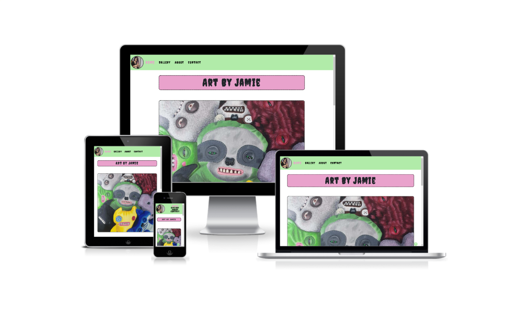

---
## Contents

### [UX](#ux)
### [User Requirements and Expectations](#user-requirements-and-expectations-1) 
### [Developer goals](#developer-goals-1) 
### [User Stories/scenarios](#user-storiesscenarios-1)
### [Design Choices](#design-choices-1) 
### [Wireframes](#wireframes-1)
### [Features](#features-1)
### [Technologies Used](#technologies-used-1)
### [Depolyment](#deployment) 
### [Testing](#testing-1) 
### [Bugs](#bugs-1)
### [Credits](#credits-1)
---
## UX:

### Project goals: 

The goal of the project is to raise and create an awareness of Jamie’s artwork among other artists, employers and collectors. The website acts as a portfolio for Jamie, showcasing their best artwork. The site will be easy to navigate around and contain information relevant to Jamie.  Information on the website is easy to locate and navigate.

---
### Target Auidence: 

The audience for the site will be other artists and aspiring artists in the art community, these artists might be students or other artists wanting to team up and collaborate. Other visitors to the site would be potential employers wanting to employ the artist to work on a project for them, this could also include art galleries/collectors. 

---
### Target Audience goals: 

#### Students/other artists: 

- Relevant written information about what Art by Jamie is about 

- Clear navigation

- Relevant visuals information 

- Contact information

- Clear and accurate descriptions of artwork
---
#### Employers: 

- Relevant written information about what Art by Jamie is about 

- Contact information and how to contact the artist

- The type of work Jamie produces

- Where the artist is located
    
- What the artist specialises in so that they can see if commissioning them would meet their business needs

---
#### Art Gallerys/collectors:

- Relevant written information about what Art by Jamie is about 

- Contact information and how to contact the artist

- The type of work Jamie produces

- Where the artist is located so that they can determine if their work would be relevant to their gallery

---
#### Artist (business) goals: 
After interviewing Jamie, I determined that their goals for the site are as follows: 

- To provide a good experience to the users

- To display Jamie’s best artwork to viewers

- To give the viewer's background information about the artist and what they’re about, along with what their future plans are

- To give viewers a way of connecting with Jamie 

- To help to create an audience for Jamie’s artwork
---
## User Requirements and Expectations 

The website will feature mainly visual content,  as the audience will contain the majority of visual people. The other elements within the page will be straightforward, easy to use and flow nicely creating a balance between visual imagery and information. Collectors or businesses will be able to easily find contact information on the site. 

The content on the pages will be easy to navigate around. There will be a navigation bar at the top which clearly labels the different areas of the website. The information on the navbar will be organised in order of user importance. As well as this text areas within the pages will give written ques about where the users should check out next. Such as “commissions are now open” There will also be a link to the contact form in the footer as well as links to social media and contact details. All this will lead to the user having a good fluid experience on the website. 

Art by Jamie is a great site for its audience because it displays information relevant to the user's expectations, all three audiences have well-defined and clear pathways that they can take to reach the information they need. The website is structured in a way that prioritises the importance of information to the user. There are also multiple pathways that users can take to reach their end goals(cta points). This makes the site informal and increases user engagement with the different pages.

---
## Developer goals: 

My goals for the site are as follows: 

- To create a professional,  fun and engaging site where viewers can see all of the information about Jamie structured in a nice clean way. 

- To showcase Jamie’s personality to the viewer through design choices building an emotional response with the viewer

- To create a project that I could use in my portfolio

---
## User Stories/scenarios: 

### First-Time users:

#### User 1 Student/artist
 As a student/artist, I want to be able to

- Find and locate information about Jamie easily.

- I want the information to be clear and descriptive

- I want to see Jamie’s artwork and information about the artwork

- I want to learn about who Art By Jamie is

- I want to be able to contact Jamie to see if they want to collaborate or to ask them more in-depth questions(interview them)
- I want to see their social media accounts so that I can follow and connect with them. 
---
#### User 2 Gallery/collector
As a gallery, we want to be able to:

- Find out who Jamie is

- Find out what their art style is

- Find out where they are located. 

- Make contact with them to see if they’d want their work to be displayed in our gallery/ see if we could purchase some of their work for our collection. 

- View their social media accounts so that I can follow and connect with them. 

---
#### User 3 
 Business-As a business, we are looking for an artist to commission. We want to be able to 

- Find out as much about the artist can their artwork meet our business needs

- Make contact with them to see if they’d be interested in working with us

- Find out where they’re located, can they commute to a location of our choosing? 

- View their social media accounts so that I can follow and connect with them. 
 
---
#### User4- Artist(Jamie)
    
- See my best work all in one place 

- Showcase my work to employers/artists and galleries
---
### Returning Users: 

#### User 1 Student/artist
 As a student/artist, I want to be able to: 

- See any updates that Jamie has on their life and art practice

- View their newest artwork

---
#### User 2 Gallery/collector
As a gallery, we want to be able to:

- See any updates that Jamie has on their life and art practice

- View their newest artwork

---
#### User 3 Business
As a business, we want to be able to: 

- See any updates that Jamie has on their life and art practice

- View their newest artwork

---
#### User4 Artist(Jamie)

- Display my newest and best artwork 

- Display my evolving art practice in order to meet the needs of other audiences in the future. 

## Design Choices 

When designing this site, I wanted to create something that showcased Jamie's unique and funny personality to the viewer. Originally I started off with a purple and grey colour scheme. However, this was really boring and didn’t achieve the goal that I wanted it to. I had the idea of using one of Jamie’s pieces titled “my creepy children” as a basis for the colour palette on the site. I extracted the colours for the palette using Adobe Colour Wheel. I then experimented with different colour combinations on the website until I found one that I really linked and more importantly Jamie really liked too. 

---
### Colors: 

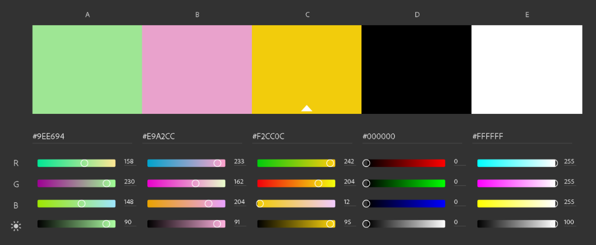

### Body: #000000:

 This created a background that made the foreground colours pop and stand out. 

### Header and navigation: rgba (158,230,148,0.8)

This green added a nice contrast with the white background and black text. 

### Title, form and about information sections: #E9A2CC

This pink again created a nice contrast with the black text colour and really helped to highlight sections. 

### Footer: #F2CC0C

The colour used in the footer is the one that I am most conflicted about, although it does add some nice differentiation from the pink and green. The black text also looks nice over the yellow. 

### Text: #000000, #E9A2CC

I used black for all the text on the site keeping consistency. I added pink to the hover pseudo to contrast with the black text. 

---
### Fonts:
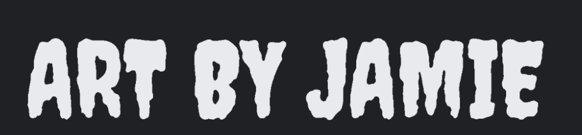
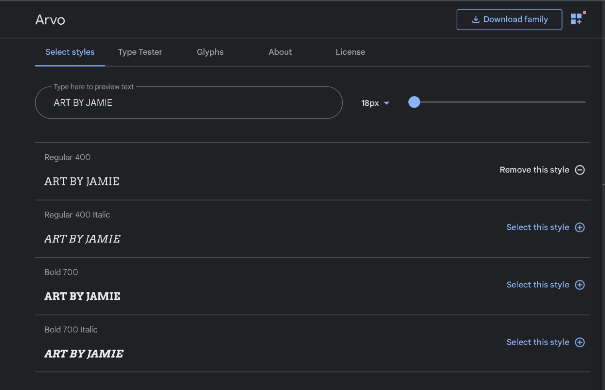 

I used google fonts Creepster and Arvo on the site. Creepster added a lot of personality to the headings and titles. It also really complimented the colours and imagery of Jamie's Art. Whilst the Arvo created a nice balance and added elegance to the written information sections making it easy for the user to read. 

---
### Imagery: 

The images on the site all came from Jamie, I chose to use ‘my creepy children’ as the hero image because I wanted it to be the first thing users see when they go onto the site. It injects a lot of personality from the get-go, triggering an emotional response from the viewer and visually telling them what Art by Jamie is all about. The images in the gallery were selected by Jamie. They were organised into different sections for the different types of artwork Jamie wanted to show. This creates a well-organised, structured,  visual information layout.  I used the logo and the image in the about section to put a face onto Art by Jamie, creating another emotional response from the user. The image selected in the about section was also used quite literally as a way of painting a picture to show the user what Art by Jamie is all about. In the footer, I used easily recognisable icons so that the user can see Jamie’s external social links in a clean and practical manner the icons came from Font Awesome. 

---
### Styling: 

All the containers apart from the maps were given a border-radius, creating a slight curve that was more aesthetic, the border styles were set to dashed with a 3px size to create the impression that they could be cut out or had been stuck in. This creates a nice consistent artbook style. The map was set to container fluid because I wanted it to stand out and contrast against the other containers. There is also a breakout image on each page to help to break up visual and written information. This results in a more aesthetic, and fluid website. I added a pseudo to the images in the gallery to limit the amount of written text on the page. I added the content for each pseudo as names of the pieces so that the user can click on the images to view their details. I decided against adding this to the larger images on the index and about page because I felt that it was too distracting for the user. 

---
## WireFrames: 

Here are the wireframes for all four pages of Art By Jame on Desktop, Mobile and Tablet. Although my final side differs slightly from these wireframes. They helped me to create consistency across the site. 

---
## Features: 
Here is a list of the features that are currently implemented on the website as well as plans for future features: 

### Current Features:

### Navbar
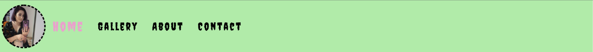
- The navbar includes the logo for Art By Jamie and menus for each different page across all pages. 
- The logo includes a link back to the home page. 
- The links for the different pages all have a class of active when on the appropriate page, making it easy for the user to see which page they're on. 
- The links have a hover effect so that the user can see the feedback for which link they are about to click on. 
- The navbar remains fixed to the top across all devices making it easy for the user to navigate around the site. 
- Is resposive accross all devices

### To the top button

- The to the top button acts as a way for the user to get back to the top of the screen on each page. 
- It includes a link to each page so that the user can just click the button instead of spending large periods of time scrolling. 
- Is resposive accross all devices

### Hero image
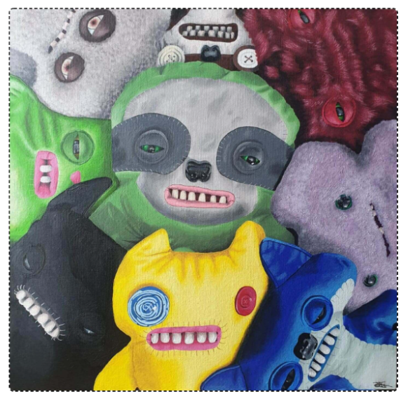
- The hero image on the index.html page is a picture of one of Jamie's paintings. The images act to grab the user's attention and display to them what Art By Jamie is all about. This helps to trigger an emotional response from the user. 
- The image sets the style for each page that follows e.g colours and fonts used on the site which work well with this image furthering the emotional response from the user. 
- Is resposive accross all devices

### About Jamie's image
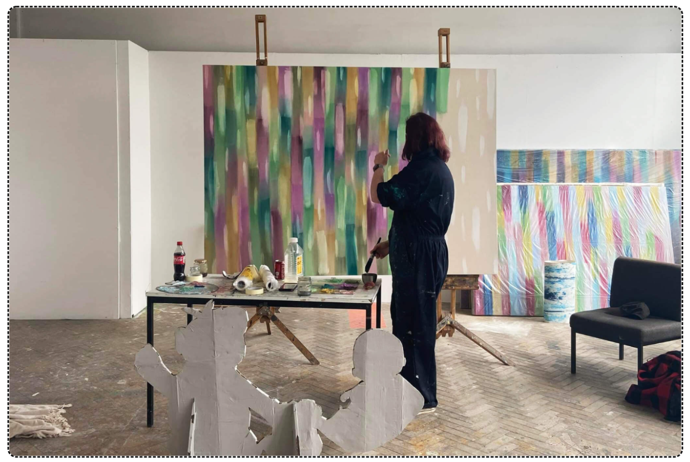
- The image is a photograph of Jamie's painting. I used this image as a literal visual representation of Jamie painting the picture of what they're all about to the user.
- Is resposive accross all devices

### Breakout image
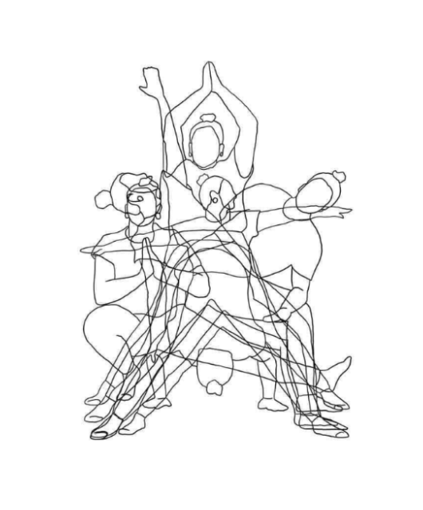
- The break-out images at the bottom of each page act as a way of dividing written and visual information without drawing too much attention away from the page's content. 
- Is resposive accross all devices

### Callout 
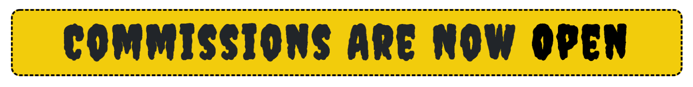
- The callout acts as a way of giving users an easier way to go straight to contacting Jamie. 
- Is resposive accross all devices

### About information
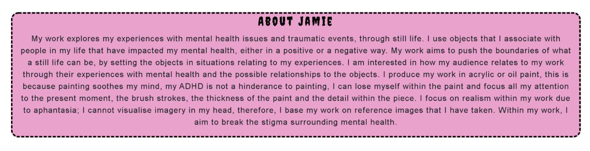
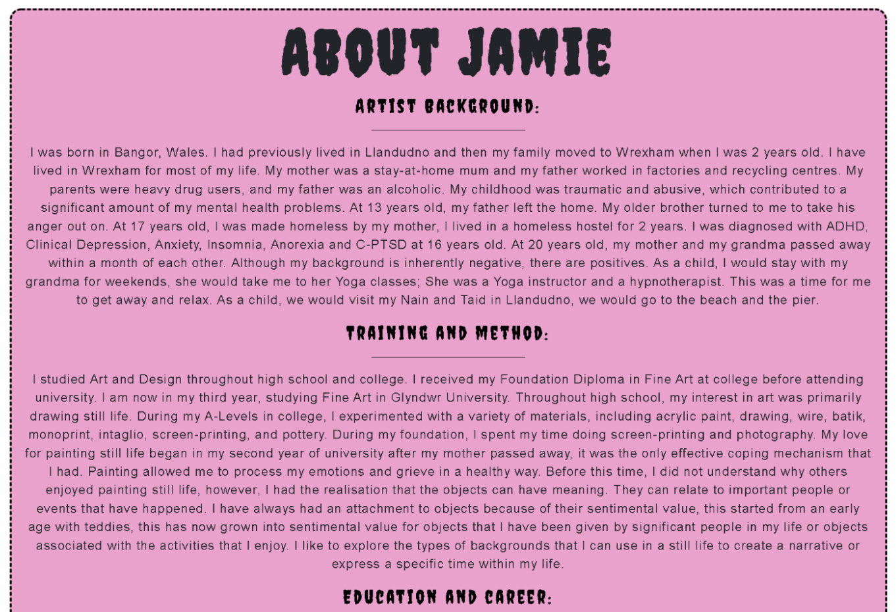
- The about information gives the users of the site all the relevant information that they need to know about Jamie. 
- They help to again trigger an emotional response from the viewer. They are placed on separate pages in a way that makes the user want to read more about Jamie after seeing the first about information on the home page. 
- Is resposive accross all devices

### Interactive gallery
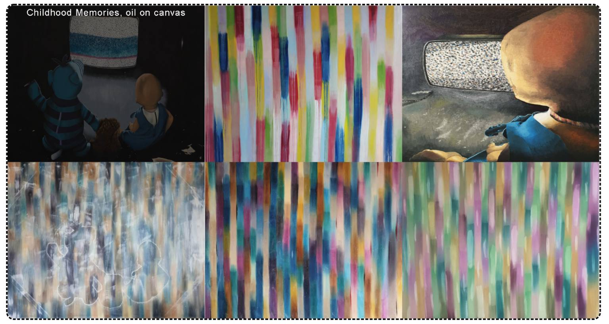
- The gallery features all of Jamie's best artwork 
- The gallery is responsive across all devices 
- The gallery uses a hover effect to break up written and visual information so that the user can interact with the images to find the appropriate information instead of being overloaded. 
- Provides alternative in-depth descriptions for visually impaired users to increase accessibility

### Video
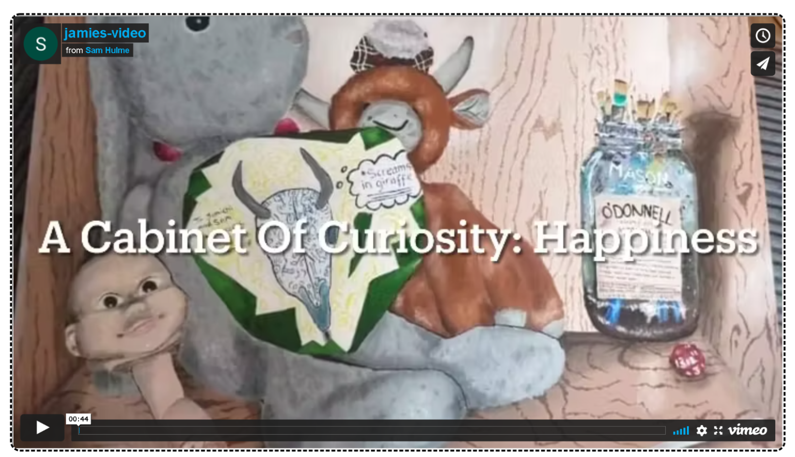
- The video features Jamie talking about their work
- The video is responsive across all devices
- The video helps to build an emotional connection with the user as they can hear what Jamie sounds like

### Map
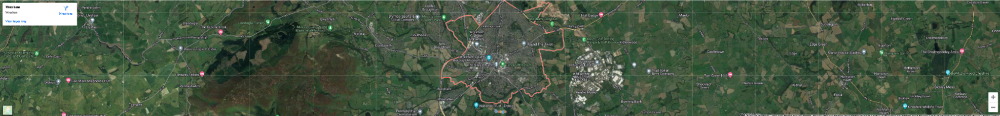
- The map shows the location of Art by Jamie to the user 
- Is responsive across all devices 

### Form
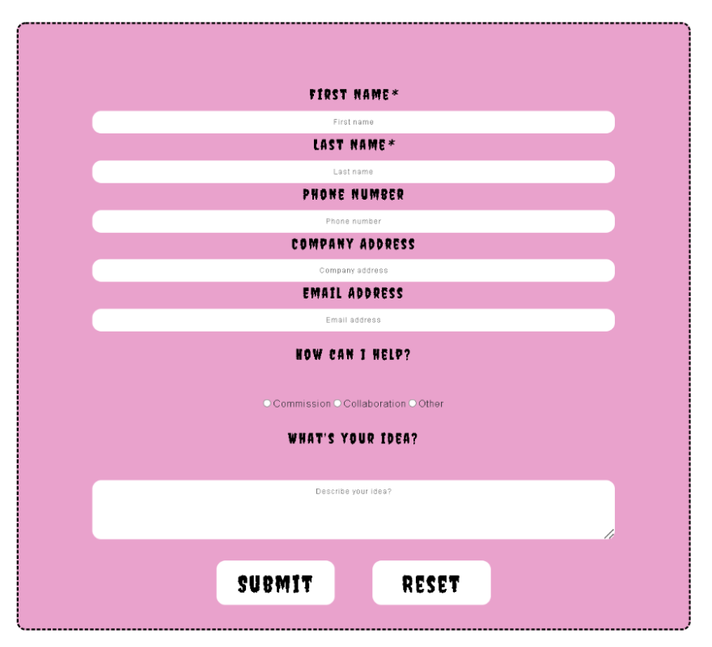
- The form gives the users a way of contacting Jamie 
- Helps to filter contact information into different sections for Jamie
- Is resposive accross all devices
---
### Future Features:

In the future the site will have a blog section for more interaction with the audience and the Youtube button in the footer will link directly to Jamie's Youtube channel. It doesn't at the moment because they don't have one but I know that they are planning on creating one in the near future. I will also add an artist C.V to the page once they have gained more experience. If I'd had more time I would have also liked to put the images in a carousel so that they could be displayed larger when clicked on. There will also be an error 404 page in the future. I had to remove what I had developed for this due to the time limit. 

### Naming Conventions and Structure of Files 

- The files on the site have been named consistently and structured into relevant sections
- All names contain lowercasing and no special characters
- The images have been organised into different sections. 
    - The first contains images that are the most important on the site: logo, favicon, hero image and about image(page defining images). I wanted them displayed outside of the lower files. 
    - The lower files (acrylics, digital and drawing, oil, readme images) have been organised in this way to increase readability and to categorise them into different sections 
    -where an image has a number after e.g hands-1 this indicates the series number of the painting so 1 is the first etc. 
    - I have also left images in these files that could be used in the future if the gallery was expanded or on additional pages etc, adding an element of future-proofing to the site. 

## Technologies used: 

### Languages: 

1. [HTML5](https://www.w3schools.com/html/default.asp) To create the structure and the content of the website. 

2. [CSS3](https://www.w3schools.com/css/) To create the style for the website and its content. 
---
### Tools and libraries:

1. [Gitpod](https://www.gitpod.io/) To create the code for the website.

2. [Adobe Photoshop](https://www.adobe.com/uk/products/photoshop.html) to edit the images, ready to be displayed online.

3. [Github](https://github.com/) To store, host and deploy the website.

4. [Balsamiq](https://balsamiq.com/wireframes/?gclid=CjwKCAjwkYGVBhArEiwA4sZLuGTzEexF0Kcpb2hzGS4R6E-5vcxNOjKv1cIAJrPG4yCImcQxZ7tIaxoCN7EQAvD_BwE) To create the wireframes for the website.

5. [Bootstrap](https://getbootstrap.com/) To add responsiveness to the website so that it performs well on all devices.
 
7. [Tinypng](https://tinypng.com/) To compress the photos for the website so that it has better performance. 

8. [Google map generator](https://google-map-generator.com/) used to get the src for the map of Wrexham, for some reason I couldn’t get the src from google maps directly. I only used it to get the src, not the code. 

9. [Adobe Illustrator](https://www.adobe.com/uk/products/illustrator.html) To create the favicon.

10. [Google Fonts](https://fonts.google.com/) For the fonts on the site. 

11. [Font Awesome](https://fontawesome.com/) For the icons on the site.

12. [Grammarly](https://app.grammarly.com/) To correct my horrendous spelling.

13. [Adobe Colourwheel](https://app.grammarly.com/) [Coolors](https://coolors.co/0b3954-f17105-bfd7ea-e0ff4f-fefffe) To get the colour palette for the website.

14. [Cloud Convert](https://cloudconvert.com/webp-converter) To make the logo a webp.

15. [Jigsaw](https://jigsaw.w3.org/css-validator/) [Validator](https://validator.w3.org/) To validate.

16. [Cleancss](https://www.cleancss.com/css-beautify/) [Html Formatter](https://htmlformatter.com/) To format code.

---
## Deployment

### This site is deployed in git hub pages. These steps were taken on deployment

1. Login and locate the repository titled [art by jamie](https://github.com/SamHulme1/art-by-jamie).
2. Locate the settings at the top of the repository menu. Make sure not to click the settings at the top of the page,
3. Scroll down the page, to the left you should be able to see pages under Code and Automation click pages. 
4. Change the source branch from none to main using the dropdown menu. 
5. Doing this will refresh the page, scroll back down and locate the link to the active page. Click the link to see the deployed site!

## Testing 

### Testing User's Stories 

### User 1- Student/artist
 As a student/artist, I can easily navigate around the site, finding the relevant information I want. I can read about Art By Jamie, view their artwork, view their social media, and contact them. I can do this by: 

- Navigate around the different pages using the clear and functional navigation elements at the top and bottom right of the page. Seeing clear user feedback which shows when im on different pages and which links I’m about to click on. 
- Reading the small about information on the landing page
- Viewing their artwork in the gallery, seeing the different mediums they use in the clearly identifiable different sections and see the information about the artwork by clicking on the images. 
- Reading the larger about information on the About Art By Jamie Page
- Finding their contact details in the footer at the bottom of every page
- Visiting the contact me page and sending them a direct email message
- Clicking on the links in the footer to view their external social media accounts

---
### User 2 Gallery/collector
As a gallery we can find information about who Jamie is, view their art style find where they are located, view their social media accounts and contact them. We can do this by: 

- Reading the small about information on the landing page
- Viewing their artwork in the gallery, seeing the different mediums they use in the clearly identifiable different sections and see the information about the artwork by clicking on the images. 
- Reading the larger about information on the About Art By Jamie Page
- Finding their contact details in the footer at the bottom of every page
- Visiting the contact me page and sending them a direct email message by navigating to the contact page on the navbar or clicking on the links in the callout container or in the footer 
- Clicking on the links in the footer to view their external social media accounts
- View the map located at the bottom of the contact page. 
---
### User 3
 Business-As a business, we can find out as much information as possible about the artist and their artwork. Make contact with them to see if they would be interested in working with us. Find out where they are located. View their social media accounts so that we can follow and connect with them. We can do this by:

- Reading the small about information on the landing page
- Viewing their artwork in the gallery, seeing the different mediums they use in the clearly identifiable different sections and see the information about the artwork by clicking on the images. 
- Reading the larger about information on the About Art By Jamie Page
- Finding their contact details in the footer at the bottom of every page
-Visiting the contact me page and sending them a direct email message by navigating to the contact page on the navbar or clicking on the links in the callout container or in the footer 
- Clicking on the links in the footer to view their external social media accounts
- View the map located at the bottom of the contact page. 
    
---
### User4- Artist(Jamie) 
As an artist, I can see all of my best work in one place on the site allowing me to showcase what I am about and show my best artwork to employers, artists and galleries. I can do this by:

- Looking at all the information displayed about myself on the about, home and gallery pages. 
- Having all the relevant information that I wanted to be displayed on the site in a clean and informative way

---
### Artist (business) 
goals have been met by the site by: 

- Displaying all information in a clear and well-structured manner. 
- Providing a good clean and responsive elements which give feedback to the users
- Displaying all relevant visual and written information to the user 
- Giving users a way of contacting and connecting with Jamie via social media and contact information. 
- Creating an emotional response from the user via the use of images and text. Helping to build an emotional connection with Jamie and their artwork which will help to create an audience/ following of Jamie's artwork.
 - Also includes information about Jamie’s future plan to help keep the audience updated. 

---
### Developer goals have been met by: 

- Creating a professional fun and engaging website via the use of design, information and user feedback/interaction across the site. 
- Revealing Jamie’s personality on the site through my use of colours, styles and fonts. 
- Creating a front-end portfolio-ready website that I am proud of. 

---
### Site responsiveness and compatibility 

#### Dev Tools

The site was tested across a variety of different devices to make sure that it is responsive for as many different devices as possible, this was done using Google Developer tools. The site was tested on the following devices: 

- Blackberry Z30
- Blackberry PlayBook
- Galaxy Note 3
- Galaxy Note 2
- Galaxy S3 
- Galaxy S8
- Galaxy S9 Plus
- Galaxy Tab S4 
- Galaxy S20 Ultra
- Galaxy Fold
- Galaxy A51
- Kindle Fire HDX
- LG Optimus L70
- Microsoft Lumia 550
- Microsoft Lumia 950
- Moto G4 
- Nexus 10, 4, 5, 5X, 6, 6P, 7, 
- Nokia Lumia 520
- Nokia N9
- Pixel 3, 4, 3 XL, 5
- Ipad mini, Ipad, Ipad Pro
- iPhone 4, SE, XR, 12 Pro
- JioPhone 2
- Ipad air, mini
- Surface Pro 7, Duo
- Nest Hub, Hub Max
- iPhone 5, SE, 6, 7, 8, X

For the devices that didn't respond as expected. Additional media queries were created to target and address these issues. Correcting the responsiveness. The site was also tested by friends and family members to test the user experience.

---
#### LightHouse 

The site was tested using Lighthouse, After the initial results I improved the site in the following ways: 
- Changed pseudo highlight from white to pink to improve contrast 
- Compressed missed images for better performance. 
- Removed the height of breakout images to correct the aspect ratio issue.
- Changed h6 in the footer to h3s. 
- Added meta description to head for better SEO. 

The finals results for the site are as follows: 

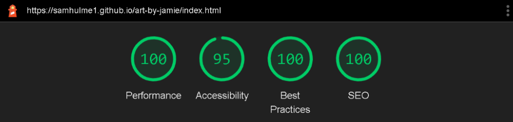
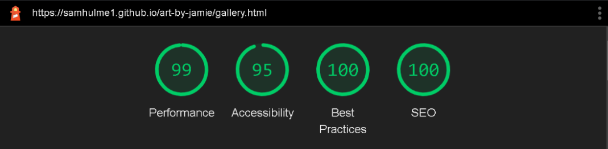

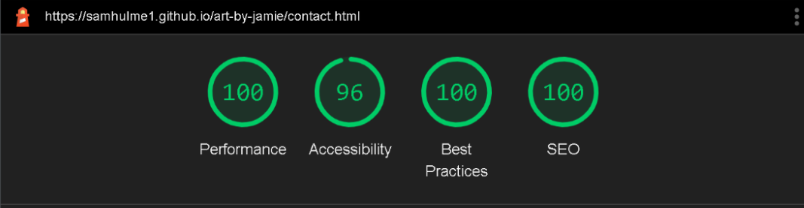

---
### Online validators 

The final validator results can be seen here:

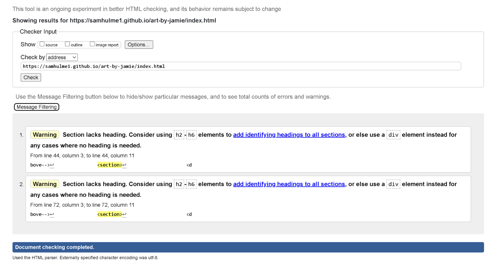
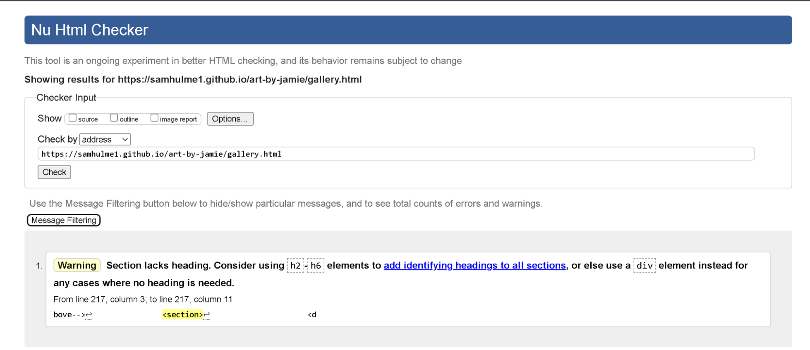
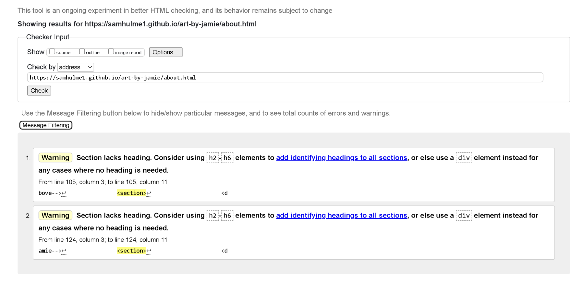
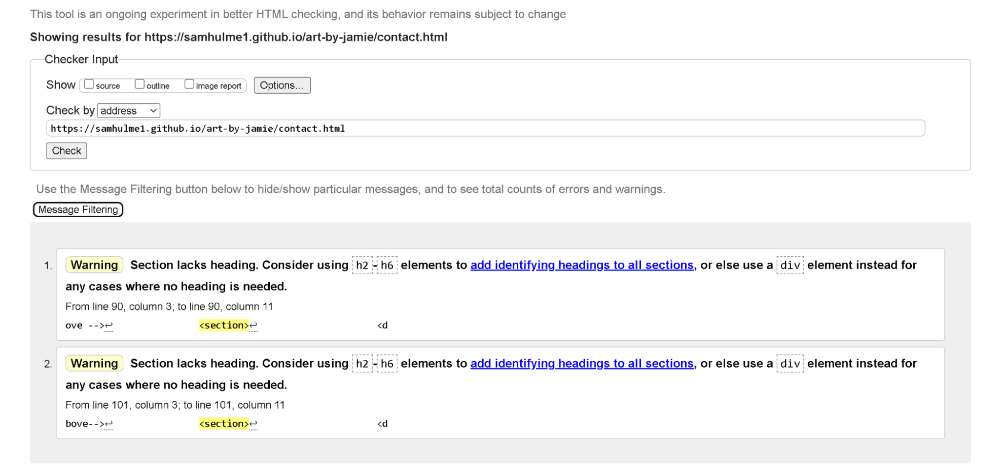
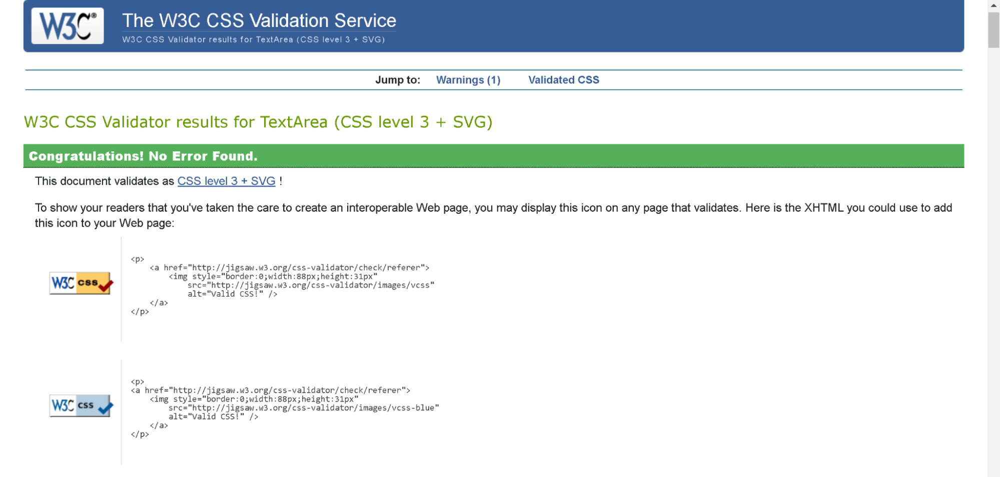

After validation, I fixed the following errors:
- Removed loose tags
- Added missing tags
- Removed unrelated attributes
- corrected elements types, specifically I changed a button to a div and changed labels in the form to headings 
---
### Manual Tests run on site

1. Do all the navigation elements work?
    - The navigation elements work on the site
2. Does the feedback on the site work?
    - The user feedback on the site works well
3. All external links open in a new tab
    - All external links opened in another tab

---
### Browser testing 

The site has been tested on Chrome, Microsoft Edge, Opera, Firefox and Safari. 
The site performed well on all browsers, however, there was an issue with the text being selected on the hover effects in Safari. 
## Bugs 
Here are some of the bugs that I've found and fixed throughout development: 

1. There was a strange _ when hovering over the Instagram logo, this was caused by a gap in front of the span.
2. initially the logo was being displayed behind the navbar. I fixed this by adding float left.
3. The images overlapped their containers. I fixed this by setting overlap to hidden 
4. I had to use some inline CSS with the logo to change the padding-left to 4px. For some reason, it wouldn't let me if I targeted it in the style sheet so I did this.
5. The logo image wasn't displaying correctly initially. I fixed this by correcting the file path.
6. Because I wanted content in the Cloudflare effects, This didn't work as expected so I had to create my own overlay for the images, this fixed this issue and I removed Cloudflare effects from the site afterwards. 
7. On smaller screens the gallery images didn't display how I wanted them to due to the set height of 300px. I fixed this by targeting the image ids and the gallery image class so that the height could be set to 100%. This resulted in a nice clean layout for smaller screens. 
8. On really small screens the links in the navbar would spill out. I fixed this by targeting them on media screen to scale them down. 
9. In the gallery the hover effect would flicker when the element was hovered over instead of displaying correctly. I fixed this by using opacity on the overlay instead of display. 
10. In safari the user can select the text in the gallery hover elements, the hover elements still work correctly but the text is selected on clicking.To fix this I had to create a paragraph element that only appeared on smaller devices. The hover effect was also disabled on smaller devices. This isn't an ideal fix but without javascript it's the best I could do. Shout out to tutors James and Christine for pointing me in the right direction to fix this. I also looked at the follow information on Stackoverflow and W3schools:

    [w3schools-troubleshoot](https://l.facebook.com/l.php?u=https%3A%2F%2Fwww.w3schools.com%2Fcssref%2Fpr_class_display.asp%3Ffbclid%3DIwAR112P1EQQwCSCX3Yt6zB4n92VzMLmS6iEX3mYjjBDHNaN0KWLGaTj6kA1Q&h=AT1-XO564Yxx5PDvHjPx6Hepzw2QW_avU4MBizdx-A8yC7he9xZrVZq-m6EpxK2-ti9gQIJKC4wSu1ca_wRe91_xOp8mymyoOj8HFZMZTVXQdjuHuJVXSLcU5R5CHlqvq-N2Qw)

    [stack-overflow-troubleshoot](https://l.facebook.com/l.php?u=https%3A%2F%2Fstackoverflow.com%2Fquestions%2F35187970%2Fcss-hover-not-working-on-ios-safari-and-chrome%3Ffbclid%3DIwAR2LnfUuZXMa1ypDcDKQRkeHj3Xh5LRVlyI2v-AEDpEh2XUxXH_SwLBLEf4&h=AT1-XO564Yxx5PDvHjPx6Hepzw2QW_avU4MBizdx-A8yC7he9xZrVZq-m6EpxK2-ti9gQIJKC4wSu1ca_wRe91_xOp8mymyoOj8HFZMZTVXQdjuHuJVXSLcU5R5CHlqvq-N2Qw)

### Bugs Left in Code:
To my knowledge there are no bugs left in the code!

## Credits 

### Code

- The code for the video came from the embed video option on Vimeo.
- Bootstrap 4 was used throughout development to make the site responsive, I used this for layout and used some of Bootstraps classes. 
- I used Google maps generator to get the src for the map, However, I only used this for the source.

### Content 

- Written content about the artist came from the artist: Jamie Thomas.
- Other written content came from me the developer.

### Media 

- All images and videos came from the artist: Jamie Thomas.
- The images were edited by me the developer to prepare them for the web. I boosted contrasts and cropped them using Adobe Photoshop. 
- Favicon was created by me using Illustrator.

### Acknowledgements 

- My mentor for the amazing help and support 
- Other students on slack for their support 
- Code Institute for the helpful materials and support in particular tutors James and Christine.
- Stack overflow and W3C for useful research materials 
